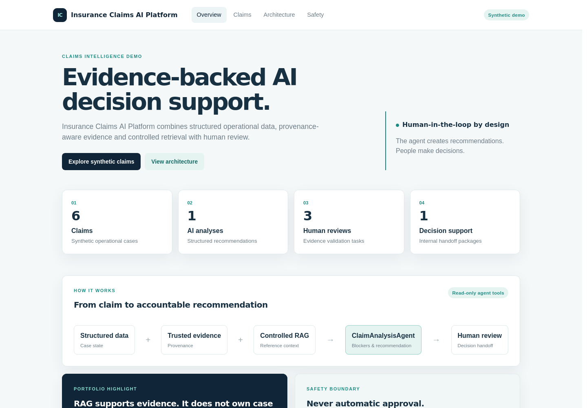
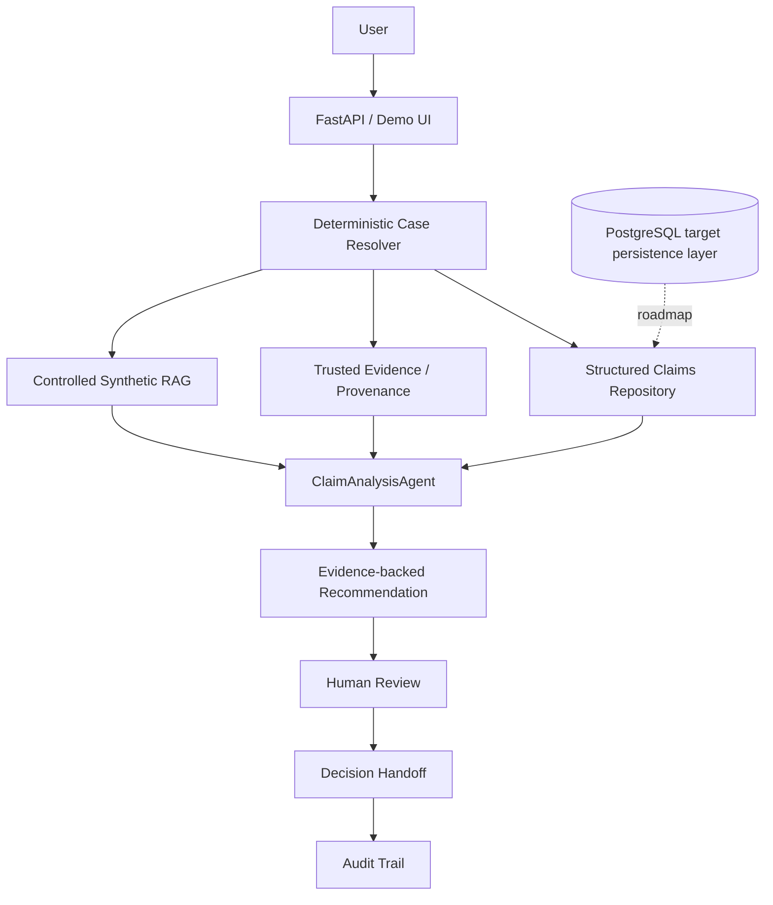
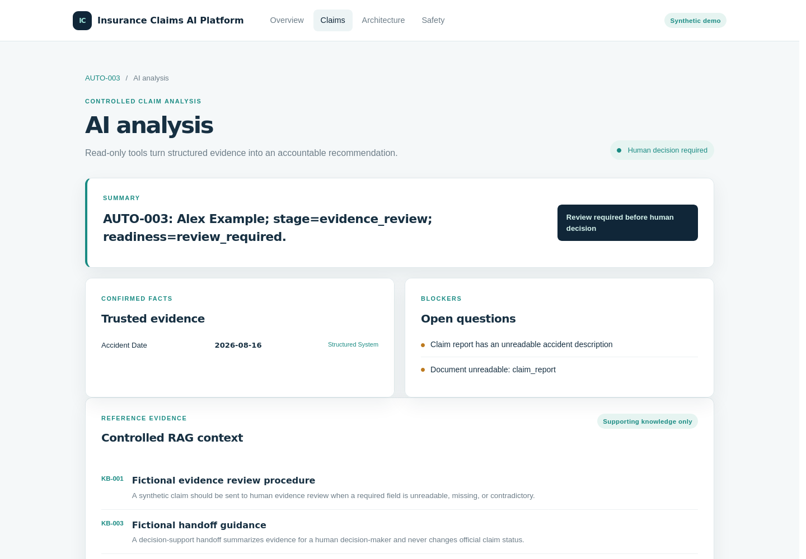
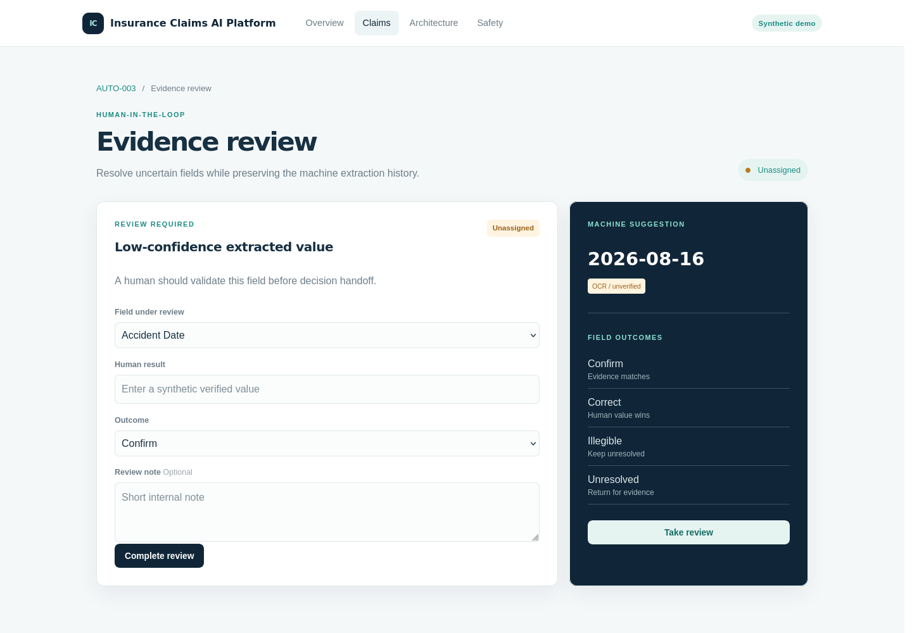
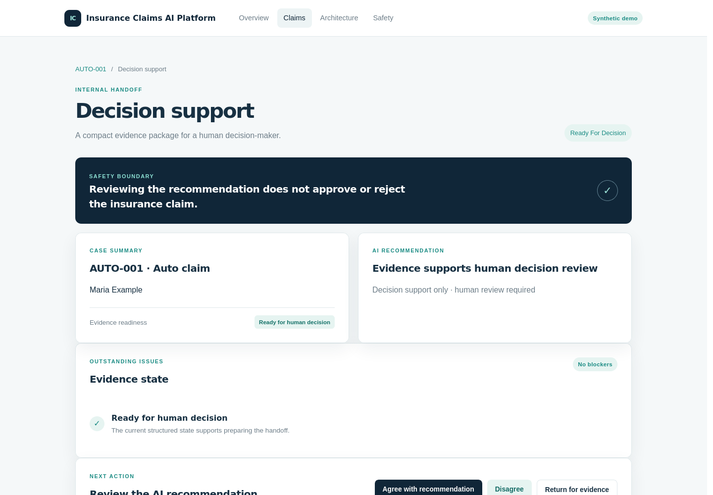

# Insurance Claims AI Platform

AI decision-support platform for insurance claims combining structured
operational data, trusted evidence, controlled retrieval, agentic analysis,
human verification and auditable recommendations.

> Independent synthetic public engineering demonstration. It contains no
> customer, employer or production claim information.

[](https://github.com/JoelRola/insurance-claims-ai-platform/actions/workflows/ci.yml)




_Operational view of synthetic claims, evidence state and review readiness._

## Why it exists

Insurance claim workflows combine structured state, uncertain document
extraction, reference knowledge and human judgment. This project demonstrates
how to connect those layers without allowing an AI system to become the
official claims authority.

## Architecture



The current public demo uses deterministic in-memory repositories. PostgreSQL
is included in Docker Compose as the target persistence service; application
repository adapters are roadmap work.

## Demo

The UI is intentionally small and screenshot-ready:

### AI analysis



_Controlled agent output combining structured state, trusted evidence and
retrieved reference material._

### Human review



_Human-in-the-loop correction of uncertain machine-extracted evidence._

### Decision support



_Internal recommendation handoff that stops before any official claim
decision._

Additional views: [claim detail](docs/screenshots/claim-detail.png), [audit
timeline](docs/screenshots/audit-timeline.png), and [architecture](docs/screenshots/architecture.png).

## How the ClaimAnalysisAgent works

The `ClaimAnalysisAgent` is one controlled, tool-using workflow. It can:

1. resolve a claim deterministically;
2. inspect structured claim state and documents;
3. inspect trusted evidence and provenance;
4. identify blockers and uncertainty;
5. retrieve synthetic reference material;
6. create a structured recommendation.

It stops at `HUMAN DECISION REQUIRED`. It cannot approve or reject claims,
modify official status, initiate payments, send emails or call production
systems. Its tools are read-only.

## Structured data, evidence, RAG and humans

| Layer | Responsibility |
| --- | --- |
| Structured repository | Case status, identity, documentation and workflow state |
| Trusted evidence | Known facts, provenance, confidence and human corrections |
| Controlled RAG | Relevant synthetic reference knowledge |
| ClaimAnalysisAgent | Operational interpretation and recommendation |
| Human decision-maker | Final claim decision |

RAG provides context; it does not override structured operational facts.

## Human review and decision handoff

Evidence reviews use `unassigned → assigned → in_progress → completed`, with
field outcomes such as confirmed, corrected, illegible and unresolved. Human
corrections outrank uncertain OCR while previous machine values remain in
history.

Decision handoff states are `draft`, `ready_for_decision`,
`under_human_review`, `reviewed` and `returned_for_evidence`. Reviewing or
agreeing with the AI recommendation does not approve or reject the claim.

## Engineering highlights

- deterministic identity resolution instead of silent fuzzy matching;
- operational truth separated from retrieved reference text;
- provenance-aware evidence with correction history;
- read-only agent tools and one auditable agent workflow;
- explicit human-in-the-loop verification;
- recommendation handoff before official decision;
- append-only audit events;
- regression tests for safety and authority boundaries;
- reproducible Docker and GitHub Actions execution.

## Safety boundaries

The platform is decision support only. It does not approve claims, reject
claims, initiate payments, send emails or modify external systems. All names,
claims, documents and reference notes are synthetic.

See [docs/safety.md](docs/safety.md) and
[docs/architecture.md](docs/architecture.md) for the detailed boundaries.

## Run locally

```bash
cp .env.example .env
docker compose up --build
```

Then open:

- Demo UI: <http://localhost:8000>
- OpenAPI: <http://localhost:8000/docs>

The Compose stack exposes PostgreSQL on `${POSTGRES_PORT:-5433}` to avoid
collisions with a local PostgreSQL installation.

## API examples

```bash
curl http://localhost:8000/health
curl http://localhost:8000/claims
curl http://localhost:8000/claims/AUTO-001
curl -X POST http://localhost:8000/assistant/analyze/AUTO-001
curl -X POST http://localhost:8000/decision-support/AUTO-001/prepare
```

## Tech stack

**Backend:** Python, FastAPI, Pydantic, Jinja2
**AI/retrieval:** controlled tool-using agent, deterministic routing,
synthetic RAG, trusted evidence model
**Infrastructure:** Docker, Docker Compose, PostgreSQL service, GitHub Actions
**Testing:** pytest

## Evaluation

The acceptance suite distinguishes system consistency from source truth:

- **System consistency:** does the assistant match the structured facts held
  by the application?
- **Source truth:** are those structured facts correct relative to source
  documents?

Human adjudication is required for the second question because a deterministic
system can consistently repeat an incorrect OCR value.

See [docs/evaluation.md](docs/evaluation.md).

## Tests

```bash
PYTHONPATH=backend pytest -q
python -m compileall backend
```

The suite uses six synthetic claims and covers resolution, provenance, RAG,
agent safety, reviews, handoffs, audit events and UI routes.

## Engineering decisions

One agent keeps auditing and authority boundaries clear. Deterministic claim
resolution avoids probabilistic identity selection. Human review exists because
OCR and extraction are uncertain. RAG does not own case status because
retrieved text is weaker than structured operational data. Automatic claim
approval is intentionally out of scope.

## Implemented vs roadmap

Implemented: FastAPI, synthetic structured repository, controlled RAG,
ClaimAnalysisAgent, trusted evidence, human review, decision handoff, audit,
Demo UI, tests, Docker and CI.

Roadmap: PostgreSQL repository adapters, richer frontend, OCR benchmark,
read-only live data integration, observability, AWS and Terraform.

## Suggested GitHub metadata

**About:** `Controlled agentic AI platform for insurance claims with trusted evidence, RAG, human review and auditable decision support.`

Suggested topics: `fastapi`, `python`, `agentic-ai`, `rag`,
`artificial-intelligence`, `insurance`, `human-in-the-loop`, `docker`,
`postgresql`, `pydantic`.
