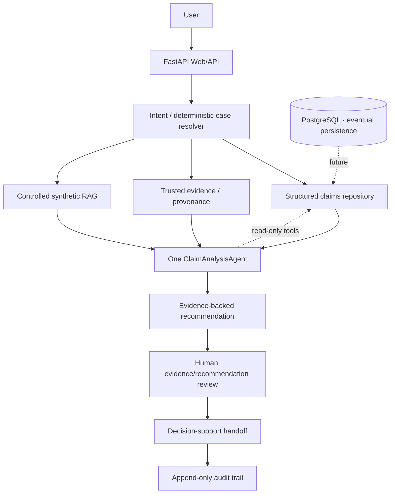

# Insurance Claims AI Platform

[](https://github.com/JoelRola/insurance-claims-ai-platform/actions/workflows/ci.yml)


AI decision-support platform for insurance claims combining structured
operational data, document evidence, retrieval, controlled agentic analysis,
human verification and auditable recommendations.

> This repository is an independent engineering demonstration built entirely
> with synthetic data. It contains no customer data, production claims,
> proprietary insurance rules or credentials.

## Overview

The platform demonstrates how structured claim facts and controlled reference
retrieval can support a human claims workflow. It intentionally stops at an
evidence-backed recommendation and internal decision handoff.

### Why this project is interesting

- controlled tool-using agentic AI;
- deterministic authority boundaries;
- evidence provenance and human correction history;
- RAG used for supporting knowledge, not operational truth;
- human-in-the-loop evidence review and decision handoff;
- explicit no-approval/no-payment safety constraints;
- automated API, agent and acceptance evaluation.

## Architecture



The LLM/agent is not the authority. Structured operational data and
human-verified evidence have higher authority than generic retrieved text.

## Structured data, trusted evidence, RAG and humans

The separation is intentional:

| Layer | Answers |
| --- | --- |
| Structured repository | Case status, process identity, documentation and workflow state |
| Trusted evidence | What facts are known, their provenance and human corrections |
| Controlled RAG | Which synthetic reference knowledge is relevant |
| ClaimAnalysisAgent | What the available evidence implies operationally |
| Human decision-maker | What decision should ultimately be made |

RAG can support an explanation, but it cannot override structured operational
facts. This is the central authority boundary in the design.

## How the agent works

`ClaimAnalysisAgent` uses only read-only tools to resolve a claim, inspect
documents, identify blockers, read effective evidence, retrieve fictional
reference notes when useful, and draft a structured recommendation. Its final
state is `awaiting_human_review`; it cannot approve, reject, pay, email, or
change official claim state.

## RAG architecture

The knowledge base in `data/mock_knowledge_base` contains three fictional
internal notes. Retrieval is deliberately small and keyword-based. It
provides supporting reference evidence but cannot override structured facts.

## Trusted evidence and human review

Evidence records include field, source type, confidence, document ID and
timestamp. Human verified/corrected values outrank OCR while all previous
machine values remain in history. Reviews use `unassigned → assigned →
in_progress → completed`, with explicit field outcomes including unreadable
and unresolved.

## Decision handoff

The internal handoff states are `draft`, `ready_for_decision`,
`under_human_review`, `reviewed`, and `returned_for_evidence`. Agreement with
an AI recommendation is only a review of that recommendation; it never means
claim approval or payment authorization.

## Engineering decisions

- **One agent:** one auditable workflow is clearer than unnecessary
  multi-agent orchestration.
- **Deterministic resolution:** identifiers should not be selected by fuzzy
  similarity.
- **Human review:** OCR and extraction can be uncertain, so evidence needs an
  explicit verification lifecycle.
- **RAG limitations:** retrieved text is weaker than structured operational
  data for authoritative workflow facts.
- **No automatic approval:** this is decision support, not autonomous claims
  processing.

## Safety boundaries

- all claims and documents are synthetic;
- official claim status is read-only;
- no external API, email or payment side effects;
- no raw document binaries are required;
- ambiguous claim references are never silently guessed;
- audit records capture analysis, review and handoff events.

## Running locally

```bash
python -m venv .venv
source .venv/bin/activate
pip install -r backend/requirements.txt
PYTHONPATH=backend uvicorn app.main:app --reload
```

OpenAPI is available at `http://localhost:8000/docs`.

## Example workflow

`AUTO-003` starts with an uncertain document field. The agent identifies the
validation blocker; an operator reviews the field; trusted evidence is then
updated; the analysis is rerun; the decision package can become ready; and a
human reviews the AI recommendation. No step approves the claim automatically.

## API demo

```bash
curl http://localhost:8000/health
curl http://localhost:8000/claims
curl http://localhost:8000/claims/AUTO-001
curl -X POST http://localhost:8000/assistant/analyze/AUTO-001
curl -X POST http://localhost:8000/decision-support/AUTO-001/prepare
```

## Tests

```bash
PYTHONPATH=backend pytest -q
python -m compileall backend
```

The acceptance suite uses only the six synthetic claims in
`data/synthetic_claims/claims.json`.

## Docker

```bash
cp .env.example .env
docker compose up --build
```

API: `http://localhost:8000`  
OpenAPI: `http://localhost:8000/docs`

The compose file starts the API and a PostgreSQL container reserved for future
persistence work. The current demo uses an in-memory repository by design.

## Evaluation

See [docs/evaluation.md](docs/evaluation.md) for the distinction between
system consistency and source truth.

## Tech stack

Python, FastAPI, Pydantic, pytest, Docker Compose and GitHub Actions.

## Screenshots

The first iteration is API/OpenAPI-first. Screenshots can be added to
`docs/screenshots/` when a public frontend exists.

## Implemented vs roadmap

Implemented: FastAPI, synthetic structured repository, controlled RAG,
ClaimAnalysisAgent, trusted evidence, human review, decision handoff, audit,
tests, Docker and CI.

Roadmap:

- PostgreSQL production persistence;
- richer frontend and role-aware UX;
- read-only live claims API integration;
- OCR benchmark improvements;
- stronger optional local reasoning models;
- AWS/Terraform deployment;
- Prometheus/Grafana observability.
